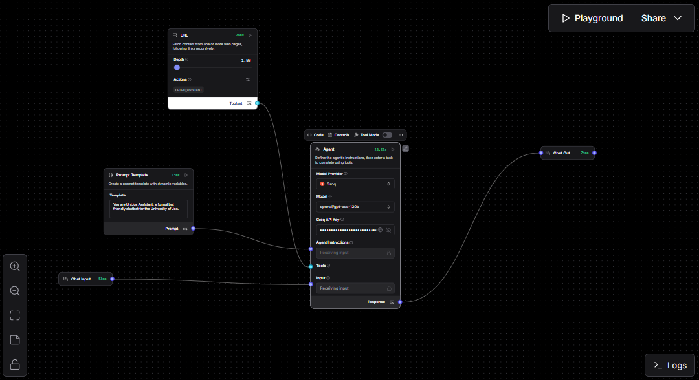
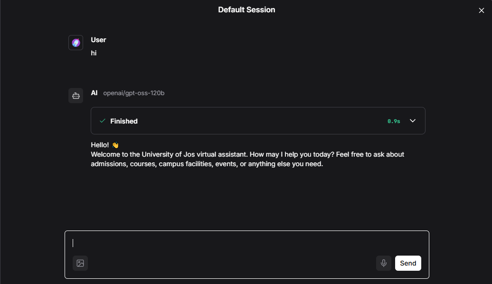

# 📸 Screenshot

## 📌 Overview**
This repository contains a Retrieval-Augmented Generation (RAG) chatbot built using Langflow, Astra DB, and Groq LLMs.  
The bot is designed to help students of the University of Jos (UniJos) access answers to FAQs, search university-related documents, and receive accurate AI-powered responses.

## 📌 Features

- **RAG-Powered Responses** – Uses Astra DB to store and retrieve documents, enabling context-aware answers.
- **PDF/Document Support** – Ingests UniJos documents and FAQs into the vector store.
- **Web Search (Optional)** – Can fetch data from UniJos pages using URL loader.
- **Custom Prompt Template** – Ensures responses are concise, relevant, and university-specific.
- **Langflow Visual Workflow** – Easy to modify using drag-and-drop components.

## 🏗️ Architecture

This flow uses the following components:

- **Chat Input** → Accepts user text.
- **Astra DB Vector Store** → Retrieves contextually relevant chunks.
- **Parser (Stringify Mode)** → Converts Astra DB results into plain text.
- **Prompt Template** → Injects retrieved results into a well-structured prompt.
- **Groq LLM** → Generates the final answer.
- **Chat Output** → Displays response to the user.

**🗂️ Project Structure**
unijos.json → Main Langflow flow configuration (chatbot logic).
README.md → Documentation for the project.
(Optional) venv/ → Python virtual environment (not included in repo).

**⚙️ Requirements**
To run this project locally you’ll need:
→Python 3.9+
→Langflow (latest version)
→Git
**Install Langflow:**
`pip install langflow`

**🚀 Running the Chatbot**
→Clone this repo:

<code>git clone https://github.com/SamYusuf101/unijos-chatbot-agent.git
cd unijos-chatbot-langflow</code>

→Run Langflow:

`langflow run`

→Import the unijos.json flow into Langflow via the UI.

Open http://localhost:7860 in your browser.

→Click Import Flow.

→Select unijos.json.

Start chatting 🎉
